<DeckTitle
  title="How to
Become
a Good Developer"
  presenter="Hyuksoon Chang"
/>

---
class: question-slide
---

# What are the traits of a Good Developer?

<v-clicks>

- Communication skills?
- Development skills?
- CS knowledge?

</v-clicks>

  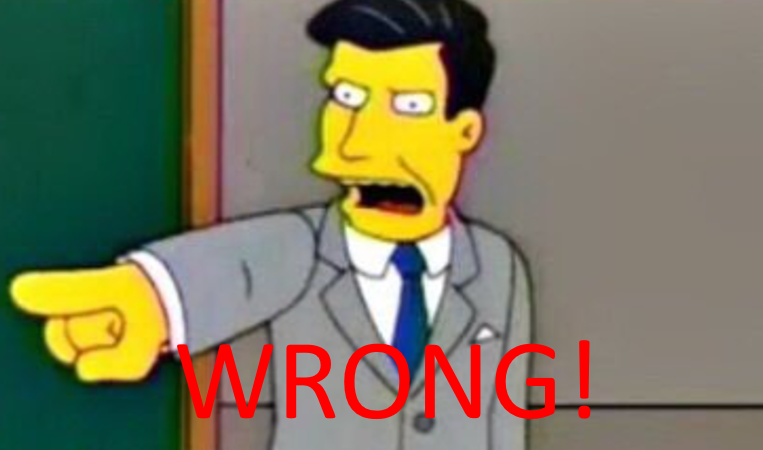

---
class: text-center
---

# If You Were a CEO, Which Developers Would You Want to Work With?

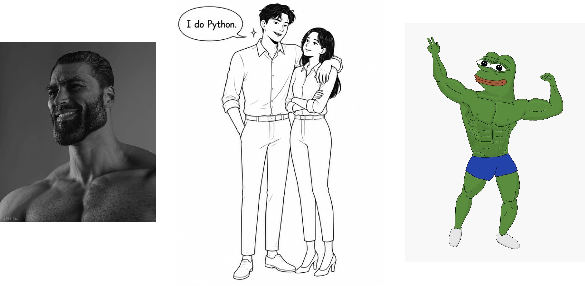{class="mx-auto max-h-90 object-contain rounded-xl"}

---
class: text-center
---

# If You Were a CEO, Which Developers Would You Want to Work With?

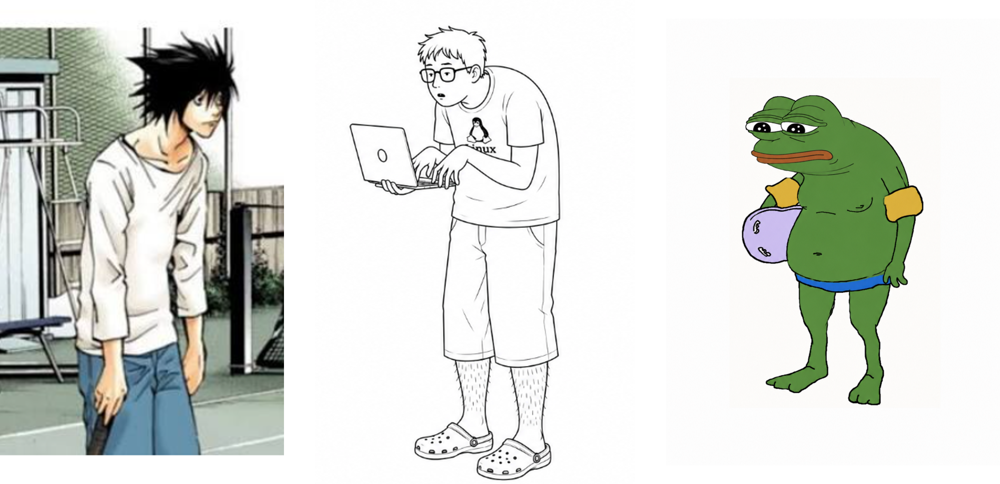{class="mx-auto max-h-90 object-contain rounded-xl"}

---
class: text-center
---

# YES

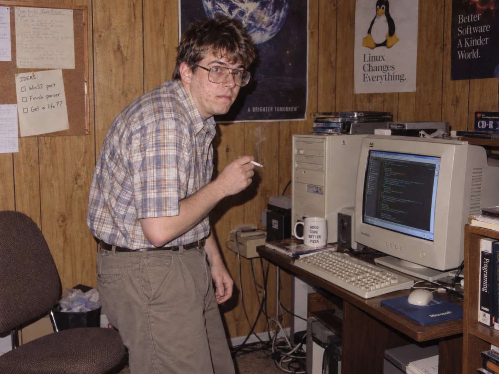{class="mx-auto max-h-90 object-contain rounded-xl"}

---

::deck-title{title="Rounded Shoulder Posture : \nCauses and Current Approaches" kicker="How to become a good developer" presenter="Hyuksoon Chang" context="Computer Science and Engineering" date="2026.09.09"}
::

---

  <h1>How Do Muscles Function? The Unidirectional Pull Mechanism</h1>

<SimpleArmSingle />

---

  <h1>Why One Muscle Isn't Enough: Every Muscle Has an Opposite Partner</h1>

<SimpleArmPair />

---

::kicker
Pathomechanics · Force Couple Imbalance
::

# Lower Trapezius vs. Pectoralis Minor
* Both muscles attach to the scapula to control its movement.

::card-grid{columns="2"}
::info-card{title="Lower Trapezius (Posterior Anchor)" tone="teal"}

  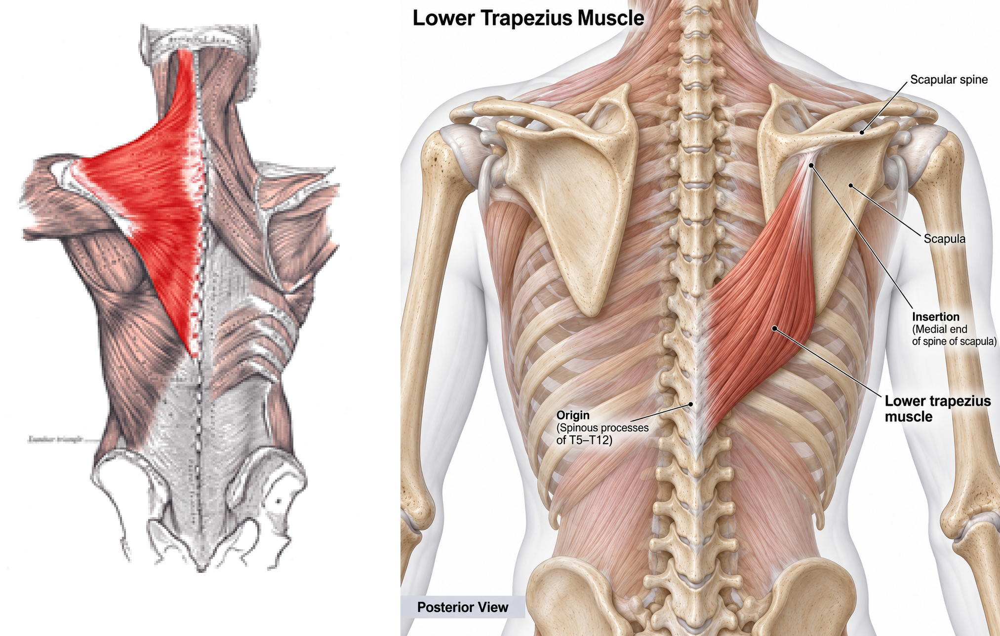

- **Weak Lower Trapezius (Relaxed)**: Too weak to pull the shoulder blade back and keep good posture.
::

::info-card{title="Pectoralis Minor (Anterior Pull)" tone="coral" v-click}

  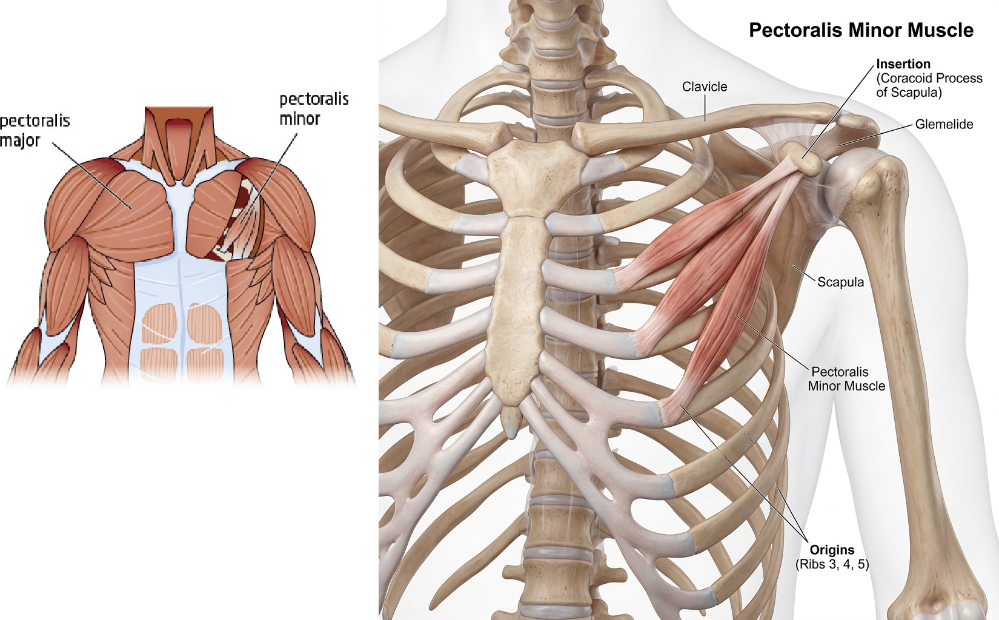

- **Short Pectoralis Minor (Tight)**: Pulls our scapula forward and downward with continuous excessive resting tension.
::
::

---

::kicker
Pathomechanics · Force Couple Imbalance
:: 
# Lower Trapezius vs. Pectoralis Minor

  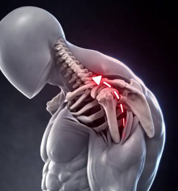

 As a result, the shoulder blade is pulled too far forward, leading to **rounded shoulder posture**.

::note-box

"Healthy individuals with a relatively short pectoralis minor resting length demonstrated scapular kinematic patterns similar to patterns previously reported for subjects with clinical shoulder impingement."   <strong>— Borstad & Ludewig, 2005</strong>

::

---

::kicker
Clinical Evidence · Intervention Study
::

# Corrective Exercise for Rounded Shoulder

**Kluemper, Uhl, & Hazelrigg (2006)** evaluated whether a 6-week intervention reduces forward shoulder posture in competitive swimmers.

  

    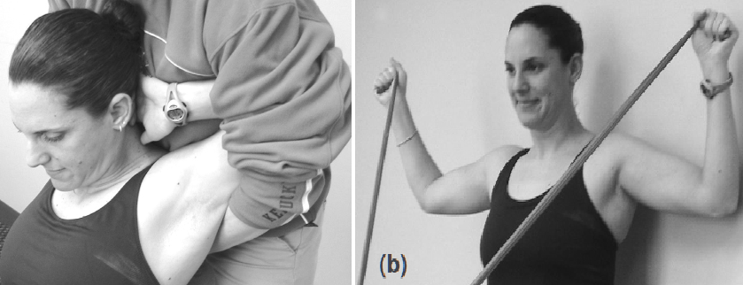
  

  

    <h3>
      
      Study Design & 6-Week Protocol
    </h3>
    <ul class="text-xs space-y-1.5">
      <li><strong>Participants</strong>: 39 competitive swimmers (Pseudorandomized)</li>
      <li><strong>Stretching</strong>: Partner stretching of pectoralis minor & major</li>
      <li><strong>Strengthening</strong>: Lower trapezius emphasis, retraction, & ER</li>
    </ul>
  

  

    

      
Exercise Group (n = 24)

      
−9.6 ± 7.3 mm

      
Significant forward posture reduction

    

    

      
Control Group (n = 15)

      
−2.0 ± 6.9 mm

      
Minimal non-significant change

    

  

---
layout: center-photo
---

::title::

::image::

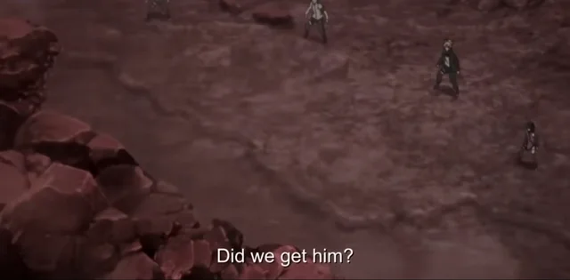

::caption::

*Survives*

---
layout: center-photo
---

::title::
::kicker
Clinical Evidence · Intervention Study
::
<h1>Multifactor Perspectives</h1>

::image::

  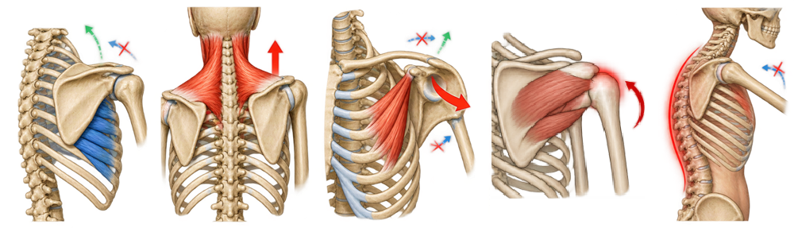
  

    

      Serratus Anterior
    

    

      Upper Trapezius
    

    

      Pectoralis Minor
    

    

      Soft-Tissue Tightness
    

    

      Thoracic Kyphosis
    

  

* Scapular mechanics are part of a **complex kinetic chain** —not an **isolated muscle** problem.

* **Ludewig & Reynolds (2009)** demonstrated that 3D scapular motion is variable and governed by multi-segmental kinetic chain interactions rather than isolated muscle defects.

---
layout: center-photo
---

::title::
::kicker
Clinical Evidence · Intervention Study
::
<h1>Multifactor Perspectives</h1>

::image::

  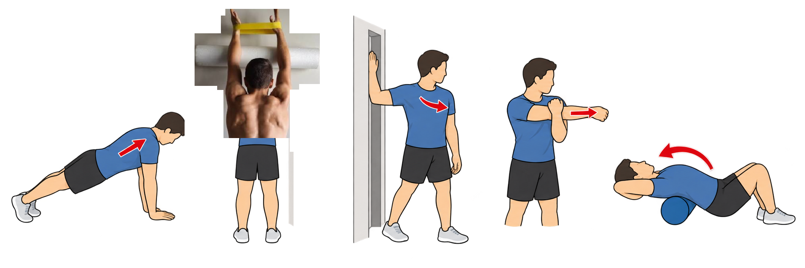
  

    

      Serratus Anterior
    

    

      Upper Trapezius
    

    

      Pectoralis Minor
    

    

      Soft-Tissue Tightness
    

    

      Thoracic Kyphosis
    

  

* Scapular mechanics are part of a **complex kinetic chain** —not an **isolated muscle** problem.

* **Ludewig & Reynolds (2009)** demonstrated that 3D scapular motion is variable and governed by multi-segmental kinetic chain interactions rather than isolated muscle defects.

---
class: flex flex-col justify-center items-center text-center h-full
---

  
What About Pain?

  
Are rounded shoulders truly bad?

  
 Do rounded shoulders really cause shoulder pain?

---
class: relative
---

::kicker
Clinical Evidence · Posture vs. Pain
::

# Does Posture Actually Cause Pain?

  <!-- Row 1: Ratcliffe et al. (2014) -->
  

    

      

        
        Ratcliffe et al. (2014)
      

      

        <em>Br J Sports Med</em>, 48(16), 1251–1256
      

    

    

      

        Systematic review of 10 clinical studies comparing 3D scapular posture and movement in patients with SIS vs. asymptomatic controls.
      

      

        ➔
      

      

        Scapular kinematics were inconsistent; no specific abnormal orientation was consistently found in the pain group. Differences reflect <strong>normal individual variability</strong> rather than pathology.
      

    

  

  <!-- Row 2: Pecos-Martín et al. (2022) -->
  

    

      

        
        Pecos-Martín et al. (2022)
      

      

        <em>J Clin Med</em>, 11(6), 1472
      

    

    

      

        Cross-sectional evaluation of forward shoulder posture (FSP) and pressure pain thresholds in 56 competitive volleyball players.
      

      

        ➔
      

      

        Forward shoulder posture itself was not associated with pain. Symptomatic players showed lower pressure pain thresholds—pain is driven by <strong>mechanical hyperalgesia</strong>, not posture alone.
      

    

  

  

    

      "Current evidence does not support a direct causal relationship between RSP and shoulder pain."
    

  

---
layout: center-photo
clicks: 2
---

::title::
::kicker
Clinical Practice Guidelines · Rotator Cuff Tendinopathy
::
<h1>Current Approach for Shoulder Pains</h1>

::image::
<v-switch class="relative mx-auto w-fit">
  <template #0>
    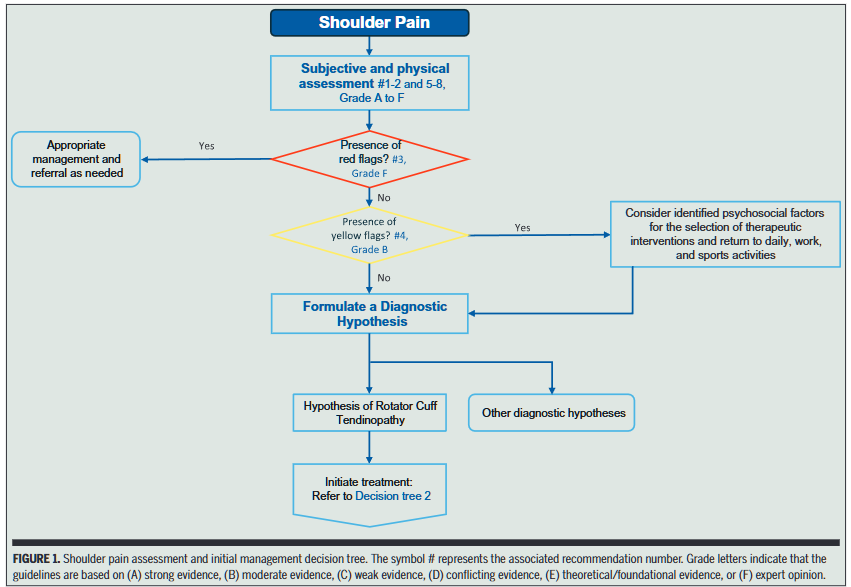
  </template>
  <template #1>
    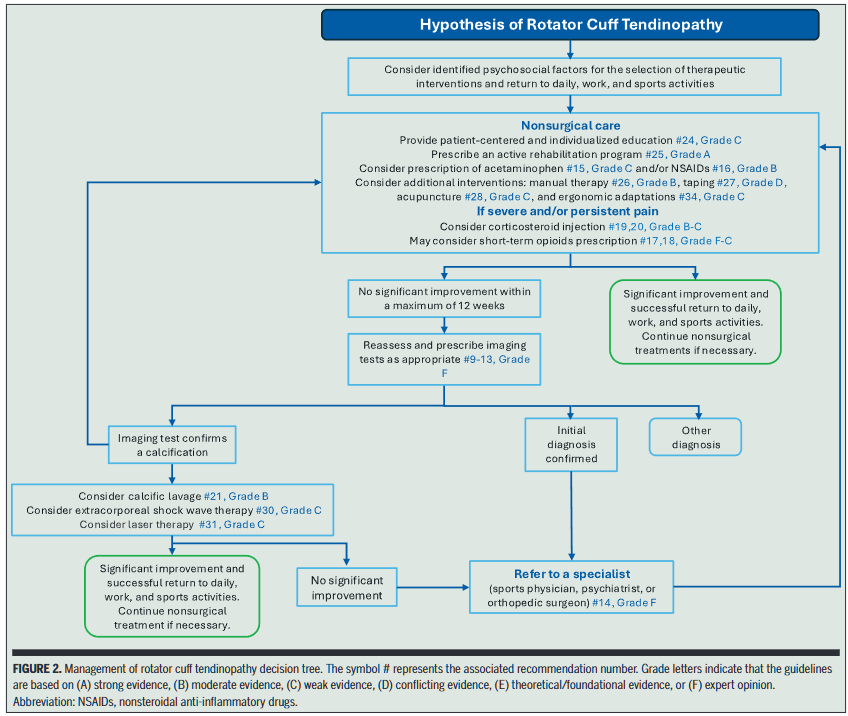
  </template>
  <template #2>
    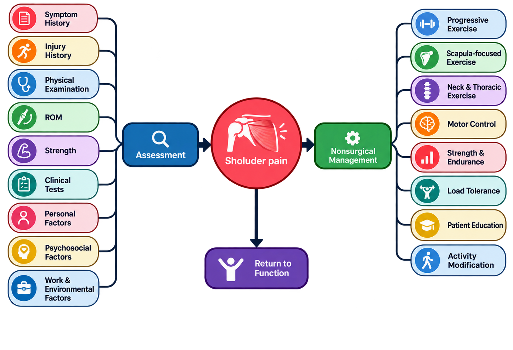
  </template>
</v-switch>

* Official clinical practice guideline supported by the American Physical Therapy Association, a leading professional organization for physical therapists in the US. (Desmeules et al., 2025)

--- 

<DeckTitle
  title="Let's
Become
a Bad Developer!"
/>

---

::kicker
Targeted Exercise Toolkit · Part 1
::

# Corrective Exercises: Mobility & Postural Control

  <ExerciseCard
    exerciseId="doorway"
    target="Rounded Shoulders / Tight Chest"
    title="Doorway Chest Stretch"
    motion="Forearms on doorframe at 90°; step forward gently without arching the lower back."
    prescription="30–45 sec × 2–3 sets"
    tone="rose"
  />
  <ExerciseCard
    exerciseId="foam-roller"
    target="Limited Thoracic Mobility"
    title="Thoracic Extension on Foam Roller"
    motion="Support head, place roller under upper back, and extend the thoracic spine backward."
    prescription="6–10 reps × 2 sets"
    tone="teal"
  />
  <ExerciseCard
    exerciseId="chin-tuck"
    target="Forward Head Posture"
    title="Chin Tuck"
    motion="Glide chin horizontally backward to lengthen the back of the neck without nodding down."
    prescription="Hold 5–10 sec × 8–10 reps"
    tone="blue"
  />
  <ExerciseCard
    exerciseId="wall-slide"
    target="Excessive Upper Trapezius Use"
    title="Wall Slide"
    motion="Slide forearms upward in a 'V' shape against the wall without shrugging shoulders."
    prescription="8–12 reps × 2–3 sets"
    tone="purple"
  />

---

::kicker
Targeted Exercise Toolkit · Part 2
::

# Corrective Exercises: Stability & Strength

  <ExerciseCard
    exerciseId="pushup-plus"
    target="Scapular Winging / Weak Serratus"
    title="Push-Up Plus"
    motion="In push-up plank, keep elbows locked straight and push the floor away to spread scapulae."
    prescription="10–15 reps × 2–3 sets"
    tone="teal"
  />
  <ExerciseCard
    exerciseId="band-row"
    target="Weak Mid-Back Muscles"
    title="Band Row"
    motion="Pull elbows back while drawing shoulder blades together and down; avoid shrugging."
    prescription="10–15 reps × 2–4 sets"
    tone="amber"
  />
  <ExerciseCard
    exerciseId="band-er"
    target="Weak Rotator Cuff"
    title="Band External Rotation"
    motion="Keep elbow pinned to side at 90° and rotate forearm outward against band resistance."
    prescription="12–15 reps × 2–3 sets"
    tone="rose"
  />
  <ExerciseCard
    exerciseId="prone-y"
    target="Weak Lower Trapezius"
    title="Prone Y Raise"
    motion="Lying face down, raise arms at 30° 'Y' angle with thumbs pointing up; initiate with scapula."
    prescription="8–12 reps × 2–3 sets"
    tone="emerald"
  />

---

::kicker
Targeted Exercise Toolkit · Part 3
::

# Corrective Exercises: Thoracic & Scapular Control

  <ExerciseCard
    exerciseId="thoracic-rotation"
    target="Limited Thoracic Mobility"
    title="Thoracic Rotation - Wall"
    motion="Stand or half-kneel sideways next to a wall with hips square. Rotate outer arm and rib cage open toward the wall to isolate thoracic rotation without lumbar compensation."
    prescription="6–10 reps / side × 2 sets"
    tone="emerald"
  />
  <ExerciseCard
    exerciseId="prone-w"
    target="Rhomboids / Scapular Retraction"
    title="Prone W Raise"
    motion="Lie face down, elbows bent at 90° in a 'W'. Squeeze shoulder blades down and back toward spine, lifting arms slightly off floor; hold 2–3s without neck extension."
    prescription="10–12 reps × 2–3 sets"
    tone="amber"
  />

---

::kicker
Evidence Base · Scholarly Sources
::

# References

  

    Borstad, J. D., & Ludewig, P. M. (2005). The effect of long versus short pectoralis minor resting length on scapular kinematics in healthy individuals. <em>Journal of Orthopaedic & Sports Physical Therapy</em>, 35(4), 227–238. <a href="https://doi.org/10.2519/jospt.2005.35.4.227" target="_blank" class="text-teal-700 underline">https://doi.org/10.2519/jospt.2005.35.4.227</a>
  

  

    Kluemper, M., Uhl, T., & Hazelrigg, H. (2006). Effect of stretching and strengthening shoulder muscles on forward shoulder posture in competitive swimmers. <em>Journal of Sport Rehabilitation</em>, 15(1), 58–70. <a href="https://doi.org/10.1123/jsr.15.1.58" target="_blank" class="text-teal-700 underline">https://doi.org/10.1123/jsr.15.1.58</a>
  

  

    Ludewig, P. M., & Reynolds, J. F. (2009). The association of scapular kinematics and glenohumeral joint pathologies. <em>Journal of Orthopaedic & Sports Physical Therapy</em>, 39(2), 90–104. <a href="https://doi.org/10.2519/jospt.2009.2808" target="_blank" class="text-teal-700 underline">https://doi.org/10.2519/jospt.2009.2808</a>
  

  

    Ratcliffe, E., Pickering, S., McLean, S., & Lewis, J. (2014). Is there a relationship between subacromial impingement syndrome and scapular orientation? A systematic review. <em>British Journal of Sports Medicine</em>, 48(16), 1251–1256. <a href="https://doi.org/10.1136/bjsports-2013-092389" target="_blank" class="text-teal-700 underline">https://doi.org/10.1136/bjsports-2013-092389</a>
    
  

  

    Barrett, E., O'Keeffe, M., O'Sullivan, K., Lewis, J., & McCreesh, K. (2016). Is thoracic spine posture associated with shoulder pain, range of motion and function? A systematic review. <em>Manual Therapy</em>, 26, 38–46. <a href="https://doi.org/10.1016/j.math.2016.07.008" target="_blank" class="text-teal-700 underline">https://doi.org/10.1016/j.math.2016.07.008</a>
  

  

    Pecos-Martín, D., et al. (2022). Mechanical hyperalgesia but not forward shoulder posture is associated with shoulder pain in volleyball players: A cross-sectional study. <em>Journal of Clinical Medicine</em>, 11(6), 1472. <a href="https://doi.org/10.3390/jcm11061472" target="_blank" class="text-teal-700 underline">https://doi.org/10.3390/jcm11061472</a>
  

  

    Desmeules, F., Roy, J.-S., Lafrance, S., Charron, M., Dubé, M.-O., Dupuis, F., Beneciuk, J. M., Grimes, J., Kim, H. M., Lamontagne, M., McCreesh, K., Shanley, E., Vukobrat, T., & Michener, L. A. (2025). Rotator cuff tendinopathy diagnosis, nonsurgical medical care, and rehabilitation: A clinical practice guideline. <em>Journal of Orthopaedic & Sports Physical Therapy</em>, 55(4), 235–274. <a href="https://doi.org/10.2519/jospt.2025.13182" target="_blank" class="text-teal-700 underline">https://doi.org/10.2519/jospt.2025.13182</a>
  

